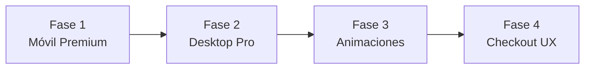

# Rediseño UI/UX Premium del Storefront — Mobile-First

Plan de modernización integral de la tienda virtual para llevarla de un diseño funcional básico a una experiencia premium, fluida y adaptativa, optimizada para dispositivos móviles.

## Contexto y Diagnóstico Actual

### Estado actual de la tienda (`donutlandia.rutaslima.app`)

| Área | Problema Actual |
|------|----------------|
| **Móvil: Header** | Header estático con logo centrado, sin animación. Ocupa mucho espacio vertical. Sin barra de anuncios ni elementos dinámicos. |
| **Móvil: Productos** | Listado en filas horizontales (1 columna). Imágenes pequeñas `80×80px`. No aprovecha el ancho de pantalla. Se ve como una lista de contactos, no como una tienda. |
| **Móvil: Carrito flotante** | Barra sólida sin backdrop-blur. Diseño plano. No invita a interactuar. |
| **Desktop: Layout** | Sidebar con categorías + grid de productos estilo Kyte. Funcional pero genérico. Textos en inglés mezclados con español. |
| **Desktop: Header** | "LOGIN OR CREATE ACCOUNT" no aplica (no hay auth de clientes). Textos en inglés. |
| **Página de producto** | Funcional pero sin galería swipeable en móvil. Sin breadcrumbs. Sin sección de productos relacionados. |
| **Footer** | Mínimo. Solo un aviso legal y "Developed by Plataforma Ramos". Sin información útil. |
| **Transiciones** | Sin animaciones de entrada. Las páginas aparecen abruptamente. |
| **Tipografía** | Fuente por defecto del sistema. Sin personalidad visual. |
| **WhatsApp FAB** | No existe un botón flotante de WhatsApp para contacto directo. |

### Referencia visual: [Blama Shop](https://www.blama.shop/productos)

Patrones premium identificados:
- ✅ Header con backdrop-blur + barra marquee de anuncios
- ✅ Grid de productos en **2 columnas** en móvil (estilo Instagram/Shopify)
- ✅ Categorías como pills horizontales scrolleables
- ✅ Botón flotante de WhatsApp con animación pulse
- ✅ Footer profesional con columnas (Navegación, Legal, Redes, Contacto)
- ✅ Skeleton loaders durante la carga
- ✅ Tipografía Inter/Geist con tracking ajustado
- ✅ Barra sticky de búsqueda + filtros con glassmorphism
- ✅ Tarjetas de producto con aspect-ratio cuadrado + hover scale

---

## Propuestas de Cambio

### Fase 1 — Layout Móvil Premium (Prioridad Alta)

---

#### [MODIFY] [StorefrontClient.tsx](file:///C:/Users/1964-oti/Downloads/PROYECTOS/PLATAFORMA-RAMOS/src/app/[domain]/StorefrontClient.tsx)

**1.1 — Header Móvil Compacto con Glassmorphism**
- Reemplazar el header estático centrado por un header sticky compacto tipo app:
  - Logo + nombre de tienda a la izquierda
  - Botón de búsqueda (lupa) a la derecha
  - Icono de carrito con badge animado
  - `backdrop-blur-xl` + `bg-white/80` para efecto glass
- Reducir la altura de ~140px a ~56px para maximizar el espacio de productos

**1.2 — Grid de Productos en 2 Columnas (Estilo Shopify)**
- Cambiar de `grid-cols-1` (filas horizontales) a `grid-cols-2` con tarjetas verticales:
  - Imagen cuadrada `aspect-square` que ocupe todo el ancho
  - Nombre del producto truncado
  - Precio en negrita
  - Botón `+` circular superpuesto en la esquina inferior derecha de la imagen
- Esto es el cambio visual más impactante: duplica la densidad de productos visibles

**1.3 — Barra de Búsqueda Expandible**
- Convertir el input de búsqueda fijo en un overlay animado que se expande al tocar la lupa
- Solo mostrar el campo cuando el usuario lo active, ganando espacio vertical

**1.4 — Categorías como Pills con Scroll Horizontal Mejorado**
- Mantener el scroll horizontal pero mejorar:
  - Indicador visual de "hay más" (gradient fade en los bordes)
  - Animación de selección con `scale` + `shadow`
  - Emoji opcional al lado del nombre de categoría (configurable desde admin)

**1.5 — Barra Flotante de Carrito Mejorada**
- Rediseñar con `backdrop-blur` + bordes redondeados `rounded-2xl`
- Añadir micro-animación `animate-bounce` cuando se agrega un producto
- Padding inferior seguro para dispositivos con barra de navegación (safe-area-inset-bottom)

---

#### [MODIFY] [ProductDetailClient.tsx](file:///C:/Users/1964-oti/Downloads/PROYECTOS/PLATAFORMA-RAMOS/src/app/[domain]/product/[productSlug]/ProductDetailClient.tsx)

**1.6 — Galería de Producto Swipeable en Móvil**
- Implementar un carousel horizontal con indicadores de puntos (dots)
- Touch swipe nativo usando CSS `scroll-snap-type: x mandatory`
- Sin dependencias adicionales de librería

**1.7 — Breadcrumbs Contextuales**
- Agregar breadcrumb sutil: `Inicio > Donas Especiales > Dona Glaseada`
- Solo visible en la parte superior, debajo del header

**1.8 — Botón de Compra Mejorado (Sticky Bottom Bar)**
- Mejorar la barra fija inferior con:
  - Efecto glass (`backdrop-blur-md`)
  - Padding seguro para iPhone (`pb-[env(safe-area-inset-bottom)]`)
  - Animación de "¡Añadido!" con confetti o check animado más suave

---

### Fase 2 — Layout Desktop Profesional

---

#### [MODIFY] [StorefrontClient.tsx](file:///C:/Users/1964-oti/Downloads/PROYECTOS/PLATAFORMA-RAMOS/src/app/[domain]/StorefrontClient.tsx)

**2.1 — Header Desktop Unificado**
- Eliminar "LOGIN OR CREATE ACCOUNT" (no hay auth)
- Traducir todos los textos a español
- Header con 3 zonas:
  - Izquierda: Logo + nombre de tienda
  - Centro: Navegación de categorías inline (pills o tabs)
  - Derecha: Búsqueda + Carrito con badge

**2.2 — Eliminar Sidebar y Usar Layout Full-Width**
- Reemplazar el layout `grid-cols-[280px_1fr]` con sidebar por un layout de ancho completo
- Las categorías se mueven al header o debajo como tabs horizontales
- Esto permite un grid de 3-4 columnas de productos que se ve mucho más moderno

**2.3 — Grid de Productos Desktop Premium**
- Tarjetas con:
  - Imagen `aspect-square` con hover zoom (`group-hover:scale-105`)
  - Overlay sutil en hover con botón "Añadir al carrito"
  - Badge de categoría en la esquina superior
  - Sombras suaves que se intensifican en hover

**2.4 — Footer Profesional Multi-Columna**
- Reemplazar el footer minimalista por uno completo:
  - Columna 1: Logo + descripción de la tienda
  - Columna 2: Contacto (WhatsApp, Email, Instagram, Dirección)
  - Columna 3: "Powered by Plataforma Ramos" + copyright
  - Fondo oscuro (`bg-slate-900`) con texto claro

---

### Fase 3 — Animaciones y Microinteracciones

---

#### [MODIFY] [StorefrontClient.tsx](file:///C:/Users/1964-oti/Downloads/PROYECTOS/PLATAFORMA-RAMOS/src/app/[domain]/StorefrontClient.tsx)

**3.1 — Animaciones de Entrada de Productos**
- Cada tarjeta de producto aparece con `fade-in` + `slide-up` escalonado
- Usar CSS `@keyframes` y `animation-delay` basado en el índice (sin librería extra)

**3.2 — Transición del Carrito Drawer**
- Mejorar la entrada/salida del drawer:
  - Entrada: `slide-in-from-right` con `ease-out` suave
  - Salida: `slide-out-to-right` con `ease-in`
  - Overlay: `fade-in` del fondo oscuro

**3.3 — Botón Flotante de WhatsApp**
- Añadir FAB circular en la esquina inferior derecha (por encima del carrito):
  - Icono de WhatsApp
  - Animación `ping` (pulso verde)
  - Al tocar, abre `wa.me/{phone}` con mensaje pre-cargado

**3.4 — Hover States Premium en Desktop**
- Tarjetas de producto: sombra que crece + imagen que escala
- Botones: transición de color + leve `scale(1.02)`
- Links: underline animado

---

### Fase 4 — Checkout Drawer Mejorado

---

#### [MODIFY] [StorefrontClient.tsx](file:///C:/Users/1964-oti/Downloads/PROYECTOS/PLATAFORMA-RAMOS/src/app/[domain]/StorefrontClient.tsx)

**4.1 — Drawer con Animación Fluida**
- Transición suave entre estados "Carrito" → "Checkout"
- Header del drawer con indicador de paso (`Paso 1 de 2`)

**4.2 — Formulario de Checkout con UX Mejorada**
- Labels flotantes o placeholders descriptivos
- Validación visual en tiempo real (borde verde/rojo)
- Botón de confirmar con estado de carga animado (spinner + texto)

**4.3 — Resumen del Pedido Mejorado**
- Imágenes miniatura de productos en el resumen
- Separadores visuales claros entre subtotal, envío e impuestos
- Total final destacado con fondo de acento

---

## Archivos Afectados

| Archivo | Acción | Impacto |
|---------|--------|---------|
| [StorefrontClient.tsx](file:///C:/Users/1964-oti/Downloads/PROYECTOS/PLATAFORMA-RAMOS/src/app/[domain]/StorefrontClient.tsx) | MODIFY | Header, grid de productos, footer, carrito, WhatsApp FAB, animaciones |
| [ProductDetailClient.tsx](file:///C:/Users/1964-oti/Downloads/PROYECTOS/PLATAFORMA-RAMOS/src/app/[domain]/product/[productSlug]/ProductDetailClient.tsx) | MODIFY | Galería swipeable, breadcrumbs, barra de compra mejorada |
| [layout.tsx](file:///C:/Users/1964-oti/Downloads/PROYECTOS/PLATAFORMA-RAMOS/src/app/[domain]/layout.tsx) | MODIFY | Importar fuente Inter de Google Fonts, mejorar variables CSS |

---

## Open Questions

> [!IMPORTANT]
> **Idioma de la interfaz**: Actualmente hay textos mezclados en inglés ("Add", "Categories", "Sort by", "Search for items", "LOGIN OR CREATE ACCOUNT") y español. ¿Quieres que todo sea en español?

> [!IMPORTANT]
> **Botón de WhatsApp flotante**: ¿Quieres que aparezca en todas las páginas de la tienda un botón flotante de WhatsApp (como en Blama Shop) para contacto directo, independiente del checkout?

> [!IMPORTANT]
> **Barra de anuncios marquee**: ¿Te gustaría una barra superior animada tipo Blama Shop con mensajes personalizables ("Envíos a todo el Perú", "Pago contraentrega disponible", etc.)? Esto se configuraría desde el panel admin.

---

## Orden de Ejecución Sugerido

1. **Fase 1** — Impacto visual inmediato para el 80%+ de usuarios que navegan desde celular
2. **Fase 2** — Alinear desktop con el nuevo estándar visual
3. **Fase 3** — Pulir la experiencia con micro-interacciones
4. **Fase 4** — Optimizar la conversión en el checkout

---

## Verificación

### Visual
- Probar en viewport 375px (iPhone SE), 390px (iPhone 14), 430px (iPhone 15 Pro Max), 768px (iPad), 1280px (Desktop)
- Verificar que el grid de 2 columnas no desborda en pantallas de 320px
- Verificar `safe-area-inset-bottom` en iPhones con notch

### Funcional
- Que los botones `+` de agregar producto sigan funcionando con el nuevo layout
- Que el flujo carrito → checkout → WhatsApp siga intacto
- Que `?cart=open` siga abriendo el carrito y limpiando la URL al cerrar

### Build
- `npx tsc --noEmit` sin errores
- `npm run build` exitoso
- Deploy a Vercel y prueba en producción
